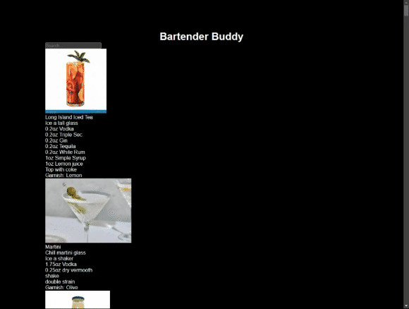
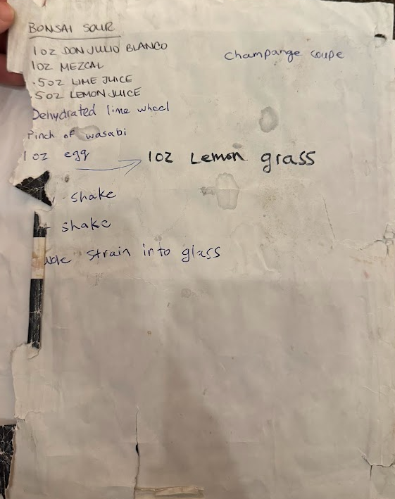

Deployed to Github Pages: [BartenderBuddy](https://alexmbepple.github.io/bartendingbuddy/)

This Project was Developed quickly to compensate for a lack of bartending experience when I was asked to cover a tuesday shift at my buddies bar.

Searching recipies in the bar book that was not alphabetized or resilient to the conditions of a wet bar was causing delays between orders.

This could be run on a nearby laptop and allow instant lookups of recipies. 

The Goal of the project was to:
- Learn the drinks through writing out the recipies 
- Create a better user experience for searching bar recipies.

# New BarBuddy


# OLD BarBook



This is a [Next.js](https://nextjs.org/) project bootstrapped with [`create-next-app`](https://github.com/vercel/next.js/tree/canary/packages/create-next-app).

## Getting Started

First, run the development server:

```bash
npm run dev
```

Open [http://localhost:3000](http://localhost:3000) with your browser to see the result.

## Future Improvements
- Can move menu items into a database instead of hardcoding them in. Put it in some object database like mongoDB.
- Host service so it is not a single local build but an available deployment.
- Management UI to add remove and change recipies in the front end.
- CSS and fromatting of the page so it doesnt jump around as much

These can be useful if expanding and using the menu at multiple locations but is not necessary for the single location and deployment for a single inexperienced bartender. This is a tool not a product.